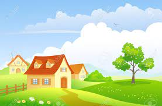

# My vacation

## 1. About a summer vacation

_Summer vacation is the **most important** time that every student eagerly waits for!_

It is a necessary part of every school’s schedule. The vacation gives you the much-needed break from routine life. You need to use this time productively in learning value added skills to unleash the creativity with you. Summer vacation is also the time to mingle with close ones. Vacation is an incredible time for a child to visit hilly destinations with family. In this article, I will share with you how I spent my summer vacation.

---

## 2. Where have I been



On my vacation, I went to my grandparents’ place and spent the rest of the vacation there. They stay in a village that is at a five-hour distance by train via village settings. This place is away from the hustle bustle of the city. It is full of natural beauty. The air is fresh and clean. The entire environment is extremely relaxing. As soon as I step into the village atmosphere, I feel so much comfort and at home. 

* The best part is that my cousins also visited the native place at that time. 
* We have planned to play outdoor activities throughout the day. I spent fifteen days there. 

I have been very well-behaved and courteous.

---

## 3. My grandfather's garden

We used to wake up at 7 am and take a leisurely walk with my grandfather. After returning home, my grandma used to prepare a healthy and tasty breakfast for us. My grandpa has his farmland of fruits and takes proper care of it and the produce. He is fond of gardening. He used to tell us about the different types of fruits, plants, [gardening practices etc.](https://gardentutor.com/ "Open")

---

## 4. A new knowledge

I and my cousins used to help him planting saplings and watering them in the garden. 

|  I  |  Mark  | Timothy  |
|-----|--------|----------|
| 3   | 2      | 4        |

My grandmother taught me to make paneer from milk and a tasty dish called “Sandesh” that is made from fresh paneer. 

> Along with enjoying my stay, I have learned several new things that have enhanced my knowledge.

---

## 5. An incredible experience

[x] _First Code example:_

```python 
def count_by(arr, fn=lambda x: x):
    key = {}
    for el in map(fn, arr):
        key[el] = 0 if el not in key else key[el]
        key[el] += 1
    return key  
```

[ ] Second Code example:

```
It's in the works
```
## 5. An incredible experience

Just like mornings, evenings have also been wonderful. I used to keep my head on my grandma’s lap and she used to tell me several interesting stories. We used to sleep on the terrace, gazing sparkling and beautiful stars all night. Sleeping under the infinite blue sky while enjoying the cool breeze was an incredible experience for me. It is not possible to get such kind of experience in the city.
